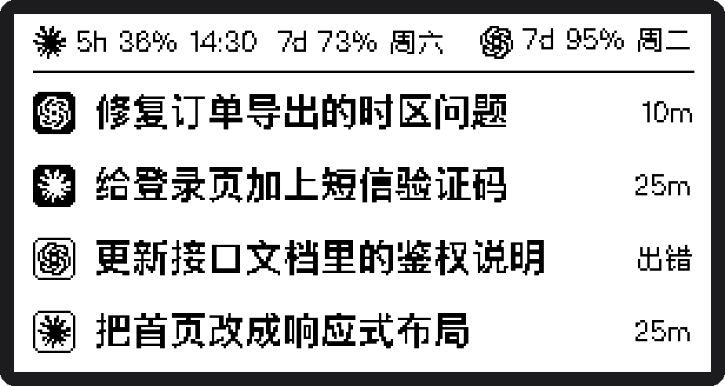
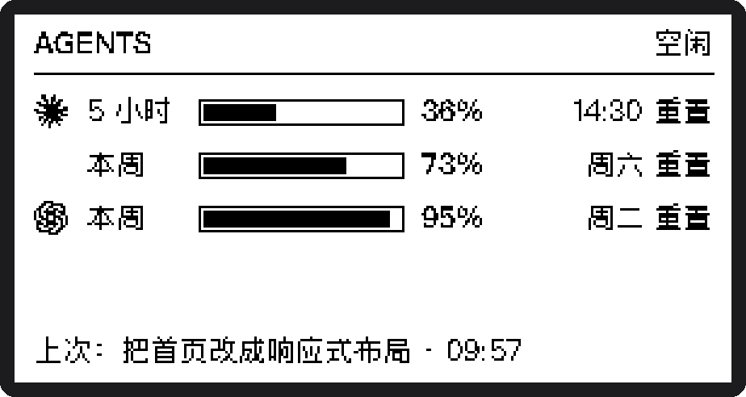
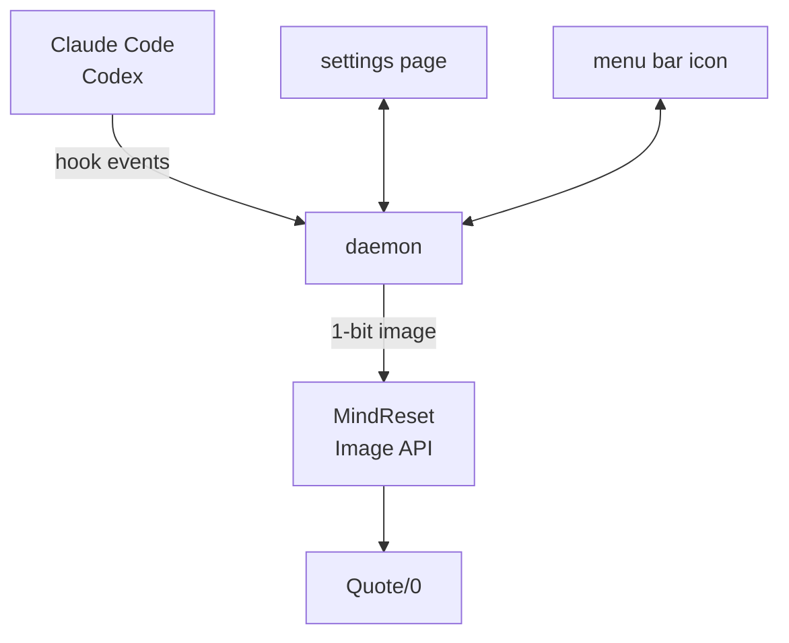
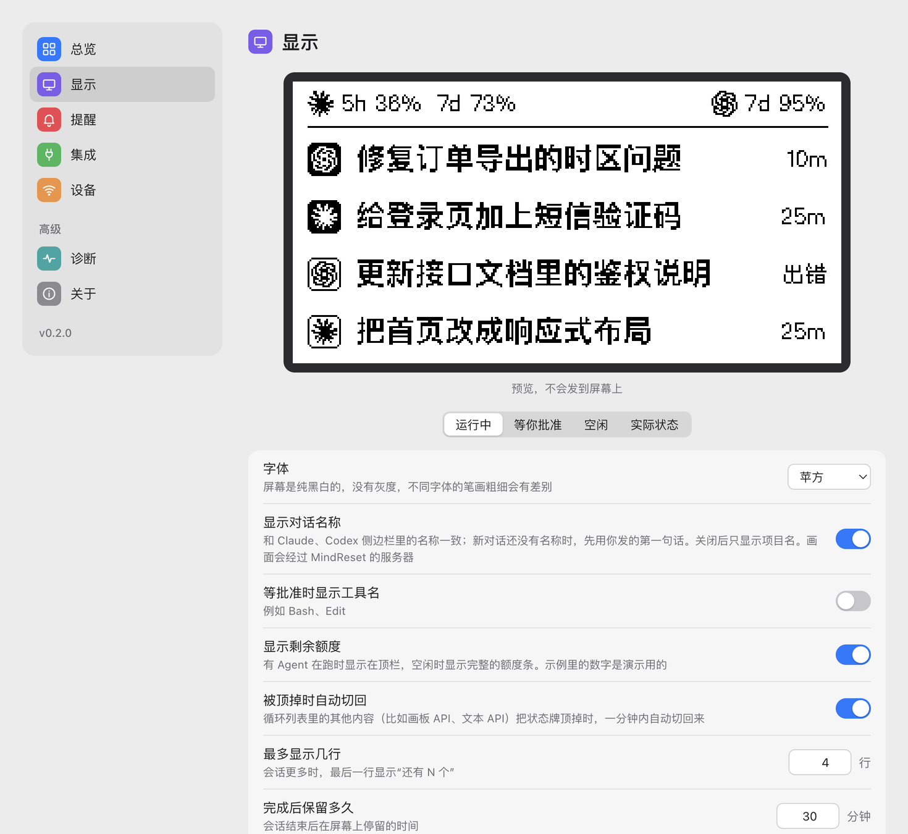

<div align="center">

# quote0-agent-board

**Show what Claude Code and Codex are doing on a Quote/0 e-ink display**

Which agent is running, which one is waiting for your approval, which one has finished: one glance at your desk.

[](https://github.com/realruian/quote0-agent-board/actions/workflows/tests.yml)
[](LICENSE)


[简体中文](README.md) · English



</div>

> [!NOTE]
> The settings page and the text drawn on the screen are in Chinese only for now.

## What it is

[Quote/0](https://dot.mindreset.tech/docs/quote_0) is a 296×152 black-and-white e-ink display made by MindReset. This project turns it into a status board for AI coding agents: the picture changes whenever Claude Code or Codex starts a task, finishes one, or needs your approval.

The feature set is modelled on [Vibe Island](https://vibeisland.app) for the Mac. The difference is that the board only displays: you still approve and answer on the computer.

## Features

- **Three screens, switched automatically**: a list while conversations are running, a full-screen inverted alert when one needs you, and your remaining quota when everything is idle.
- **Conversation names**: the same names you see in the Claude and Codex sidebars, rather than a folder name or the text of your prompt.
- **Remaining quota**: percentage left and reset time for the 5-hour and weekly windows.
- **Refreshing designed for e-ink**: the screen only refreshes when something changed, and changes close together are merged, so it does not keep flashing.
- **Local settings page**: choose the font, the alerts and quiet hours in your browser, with a live preview.
- **Menu bar icon**: shows whether the board is healthy and how many conversations are waiting for you; its menu shows the frame on the screen and lets you pause or quit.
- **Stays out of the agent's way**: the hook returns in about 12 ms and cannot fail the agent. It sits next to other tools' hooks and leaves them untouched.
- **Clean uninstall**: every file it edits is backed up first, and one command puts everything back.

## The three screens

<table>
<tr>
<td width="320"></td>
<td>

**Overview**

One conversation per row, up to four rows. The icon on the left says which agent it is: a solid square means running, an outlined one means finished. The right-hand column is a duration: how long a running task has been going, or how long a finished one took. The top bar shows the quota left for each agent and when it resets.

</td>
</tr>
<tr>
<td></td>
<td>

**Needs you**

When any conversation asks for approval, asks a question or wants a plan confirmed, the whole screen inverts. It returns to the overview once you have dealt with it.

</td>
</tr>
<tr>
<td></td>
<td>

**Idle**

With nothing running, the screen shows full quota bars, reset times and the last conversation that finished.

</td>
</tr>
</table>

The pictures are rendered from made-up data by `scripts/render_samples.py` and match the device pixel for pixel.

## How it works



- **Hook** (`bin/agent-board-hook`): a shell script that forwards the first 4 KB of each event to the daemon and exits at once.
- **Daemon** (`agent_board/daemon.py`): keeps the state of every conversation, decides when to refresh, and renders the frame locally with Pillow.
- **Push**: frames reach the device through MindReset's official [Image API](https://dot.mindreset.tech/docs/service/open/image_api).

## Requirements

- macOS. The daemon is managed by launchd, and text is drawn with the system's Chinese fonts.
- Python 3.9 or newer, with Pillow 9.0 or newer.
- A Quote/0 that is online and plugged in.
- For the menu bar icon, Apple's command line tools (`xcode-select --install`), because it is compiled on your machine during installation. Without them the installer skips it and everything else still works.
- Claude Code or Codex, or both. The desktop apps and the command-line tools both work; they share the same hook configuration.

## Installation

### 1. Prepare the device

In the Dot. app, open 内容工坊 (Content Studio) and add 图像 API (Image API) to the device's loop list. The board is shown in that slot.

It is best to keep Image API as the only item in the loop. When the device rotates to other content it replaces the board; the daemon switches back within a minute, at the cost of two extra flashes.

### 2. Save your API key

In the Dot. app, go to the 更多 (More) tab, open API 密钥 (API Key), create a key and copy it ([official guide](https://dot.mindreset.tech/docs/service/open/get_api)). Then run:

```bash
pbpaste > ~/.dot_api_key && chmod 600 ~/.dot_api_key
```

The key lives in that file only. It is never written to the configuration, the log or the settings page.

### 3. Find the device serial number

In the Dot. app, go to the 更多 (More) tab, tap the device list under your avatar, choose the device and copy its device ID ([official guide](https://dot.mindreset.tech/docs/service/open/get_device_id)).

### 4. Run the installer

```bash
git clone https://github.com/realruian/quote0-agent-board.git
cd quote0-agent-board
python3 -m pip install -r requirements.txt
python3 install.py --device <device-serial-number>
```

The daemon runs with the same `python3` you ran the installer with, so Pillow has to be installed for that one. With Homebrew's Python, `pip` may refuse to install; use `brew install pillow` instead.

The installer does the following, backing up every file it edits to `~/.quote0-agent-board/backups/`:

1. Copies the runtime to `~/.quote0-agent-board/`.
2. Registers a daemon that starts at login (LaunchAgent `com.quote0.agent-board`).
3. Appends 9 hooks to `~/.claude/settings.json`.
4. Appends 7 hooks to `~/.codex/hooks.json`. Codex will ask you to trust them the next time it starts. Pass `--no-codex` to skip.
5. Raises the device's loop interval on power to 12 hours, so the board is replaced less often. Pass `--no-hold` to skip.
6. Compiles the menu bar app into `~/Applications/Agent 状态牌.app` and has it open at login (LaunchAgent `com.quote0.agent-board.menubar`). Pass `--no-menubar` to skip.

Hooks only apply to conversations started after installation.

## Menu bar icon

After installation there is a new icon in the menu bar. It is an ordinary app too: search for "Agent 状态牌" in Launchpad or Spotlight.

| Icon | Meaning |
|---|---|
| List | All is well |
| Filled list with a number | That many conversations are waiting for you |
| Pause | Paused |
| Moon | The device is asleep or offline, and the latest frame is not on the screen yet |
| Warning triangle | The last refresh failed, or the daemon is not answering |

The menu shows the frame on the screen and the state of each conversation, and offers:

- **打开设置… (Open settings)**: opens the settings page in your browser. Opening the app again does the same.
- **刷新屏幕 (Refresh screen)**: sends the current frame again right away.
- **暂停 / 恢复 (Pause / Resume)**: while paused the screen reads "已暂停" and stays as it is until you resume.
- **退出 (Quit)**: the screen reads "已退出", and the daemon stops together with the icon. Opening the app again, or logging in the next time, brings both back.

## Settings page

Once installed, choose "打开设置…" from the menu bar icon, or open <http://127.0.0.1:8765> in your browser.



| Page | What you can do |
|---|---|
| 总览 Overview | See the current frame, whether the screen and the device are fine, quota left and the active conversations; refresh the screen or send a test frame |
| 画面 Screen | What the screen shows: font, conversation names and quota, number of rows, how long conversations stay, project aliases and hidden projects |
| 刷新 Refresh | When the screen updates: the minimum interval on power, the refresh interval on battery, whether the board always stays on screen, quiet hours, the device's scheduled sleep |
| 提醒 Alerts | Which situations take over the screen |
| Agent | Connect or disconnect Claude Code and Codex separately |
| 设备 Device | Status, power, signal and firmware; device name |
| 诊断 Diagnostics | One-click self-check, log viewer, restart the daemon |
| 关于 About | Version and file locations |

Changes are saved automatically and take effect at once. They are stored in `~/.quote0-agent-board/config.json`. The port is `web_port` in that file; restart the daemon after changing it.

Only fonts present on the machine are offered: PingFang (default), MiSans, Hiragino Sans GB, and the Ark Pixel font that ships with the project. The display has no greys and text is drawn without anti-aliasing, so stroke weight differs between fonts. When the chosen font lacks a character, that one character is drawn in Hiragino Sans GB instead of showing as an empty box; Ark Pixel currently lacks about one common Chinese character in twenty (然, 热 and 鉴, for example).

## Remaining quota

Quota comes from Codex and Claude Code themselves. The project does not log in to any account and does not read any credentials.

| | Source | Trusted for |
|---|---|---|
| Codex | The conversation records Codex writes under `~/.codex/sessions/` | Until the reset time, after which the window counts as full again |
| Claude | The local `claude` command line, asked every 5 minutes; it queries Anthropic with the sign-in it already has | Readings up to 20 minutes old; anything older shows as "—" or "暂无数据" (no data) |

Two limits:

- **Claude quota needs Claude Code signed in from a terminal.** If you only use the desktop app, run `claude auth login` once in a terminal. Without it the Claude quota stays empty; everything else works.
- **Claude quota is read through an interface Claude Code does not document.** A Claude Code update may break it; that entry then stays empty and everything else works.
- **Only the windows your plan reports are shown.** If your Codex plan reports a weekly window only, there is no 5-hour entry.

Reset times are fixed moments (a clock time today, or a weekday) rather than countdowns, so they stay true between refreshes.

## Refresh policy

Every e-ink refresh flashes the whole screen for about two seconds, so refreshes are rationed:

- The screen refreshes only when the frame changed.
- Changes within 2 seconds are merged into one refresh.
- Ordinary changes are at least 10 seconds apart; you can raise this on the settings page. A "needs you" alert ignores the limit and is shown at once.
- Running time is not updated every minute: it reads `<5m` for the first five minutes, then all rows update together every five minutes.
- Quota alone triggers a refresh only when it moves by 5 percentage points.

## Privacy and security

- **The rendered frame is all the project sends out.** Reading Claude quota has the `claude` command line contact Anthropic itself; the project never handles its sign-in. The frame is a 296×152 black-and-white image that travels through MindReset's servers to the device. It shows conversation names, agent icons, states, durations and quota percentages. If you would rather not send conversation names through a server, turn off "显示对话名称" (show conversation names) on the settings page; the screen then shows project folder names only.
- **Hooks hand data to the local daemon only.** What they forward is the first 4 KB of the event: the conversation ID, working directory, tool name and the start of your prompt. No file contents and no tool output.
- **The API key is read from `~/.dot_api_key` only** and never appears in the configuration file, the log or the settings page.
- **The settings page listens on the loopback address only**, so other devices cannot reach it. Requests must carry the page's own one-time token, and requests that change something are also checked for their origin, so other websites you visit cannot call it. The menu bar app reads that token from `~/.quote0-agent-board/run/console.json`, a file only you can read.

To report a security issue, see [SECURITY.md](SECURITY.md).

## Updating and uninstalling

Update to the latest version:

```bash
git pull
python3 install.py
```

Uninstall:

```bash
python3 install.py --uninstall
```

Uninstalling removes the hooks, the daemon and the menu bar app, and restores the device's loop interval. Add `--purge` to delete `~/.quote0-agent-board/` as well.

## Command line and file locations

From the project directory:

```bash
python3 -m agent_board.cli status
```

`status` lists the current conversations, `open` opens the settings page in your browser, and `preview out.png` saves the current frame as an image.

| Location | Contents |
|---|---|
| `~/.quote0-agent-board/config.json` | Settings |
| `~/.quote0-agent-board/logs/daemon.log` | Log |
| `~/.quote0-agent-board/last-frame.png` | The most recently pushed frame |
| `~/.quote0-agent-board/backups/` | Backups of files edited by the installer or the settings page |
| `~/Library/LaunchAgents/com.quote0.agent-board.plist` | The daemon's launchd registration |
| `~/Applications/Agent 状态牌.app` | The menu bar app |
| `~/Library/LaunchAgents/com.quote0.agent-board.menubar.plist` | The registration that opens the menu bar app at login |

## Known limitations

- **"Waiting for approval" lingers after you approve**: agent hooks have no "user approved" event, so the board only returns to running when that command finishes. Long commands are misreported meanwhile.
- **Interrupting with Esc still shows running**: an interrupt fires no end event. The row clears when you send the next message, or after 60 minutes.
- **No full-screen alert for errors or completion**: only approvals, questions and plans take over the screen.
- **The device must be plugged in**: on battery it sleeps and only updates at the moment of each scheduled wake-up, so the screen stays on the frame from before it slept. The Overview and Device pages of the settings console then say the device is asleep (the interval can be changed on the Refresh page, one minute at the shortest), and so does the `status` command; once the device wakes, the latest frame is sent again automatically.
- **Depends on MindReset's cloud service**: when your computer is offline or the service is unavailable, the screen stays on its last frame.
- **Chinese only**: both the settings page and the text on the screen.
- **Used long-term on the author's own setup only**: Quote/0 firmware 2.0.8 with the Claude and Codex desktop apps.

## Development

```bash
python3 -m unittest discover -s tests
```

For debugging, run a second instance that never touches the real device:

```bash
AGENT_BOARD_HOME="$PWD/.dev-home" AGENT_BOARD_DRY_RUN=1 AGENT_BOARD_PORT=8766 python3 -m agent_board.daemon
```

See [CONTRIBUTING.md](CONTRIBUTING.md) for more, and [CHANGELOG.md](CHANGELOG.md) for what changed between versions. Both are in Chinese.

## Credits and disclaimer

- The feature design is modelled on [Vibe Island](https://vibeisland.app).
- The bundled pixel font is [Ark Pixel Font](https://github.com/TakWolf/ark-pixel-font), distributed under the SIL OFL 1.1. The full license is in `agent_board/fonts/ark-pixel-OFL.txt`.
- This is a personal project with no affiliation to MindReset, Anthropic, OpenAI or Vibe Island. The agent icons on the screen are used only to identify the corresponding products; the names and logos belong to their respective owners.

## License

[MIT](LICENSE). The bundled Ark Pixel font is not covered by it; the font is distributed under the SIL OFL 1.1.
