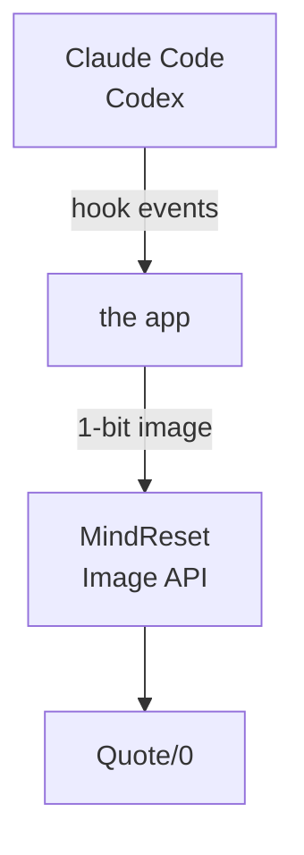

<div align="center">

# quote0-agent-board

**Show what Claude Code and Codex are doing on a Quote/0 e-ink display**

Which agent is running, which one is waiting for your approval, which one has finished: one glance at your desk.

[](https://github.com/realruian/quote0-agent-board/actions/workflows/tests.yml)
[](LICENSE)


[简体中文](README.md) · English


</div>

> [!NOTE]
> The app's window and the text drawn on the screen are in Chinese only for now.

## What it is

[Quote/0](https://dot.mindreset.tech/docs/quote_0) is a 296×152 black-and-white e-ink display made by MindReset. This project turns it into a status board for AI coding agents: the picture changes whenever Claude Code or Codex starts a task, finishes one, or needs your approval.

The feature set is modelled on [Vibe Island](https://vibeisland.app) for the Mac. The difference is that the board only displays: you still approve and answer on the computer.

## Features

- **Three screens, switched automatically**: a list while conversations are running, a full-screen inverted alert when one needs you, and your remaining quota when everything is idle.
- **Conversation names**: the same names you see in the Claude and Codex sidebars, rather than a folder name or the text of your prompt.
- **Remaining quota**: percentage left and reset time for the 5-hour and weekly windows.
- **Refreshing designed for e-ink**: the screen only refreshes when something changed, and changes close together are merged, so it does not keep flashing.
- **An ordinary Mac app**: drag it into Applications and it works, with no Python needed. Choose the font, the alerts and quiet hours in its window, with a live preview.
- **Menu bar and Dock icons**: they show whether the board is healthy and how many conversations are waiting for you; the menu bar icon's menu shows the frame on the screen and lets you pause or quit.
- **Stays out of the agent's way**: the hook returns in about 12 ms and cannot fail the agent. It sits next to other tools' hooks and leaves them untouched.
- **Clean uninstall**: every file it edits is backed up first, and 卸载… (Uninstall) in its menu puts everything back.

## The three screens

<table>
<tr>
<td width="320"></td>
<td>

**Overview**

One conversation per row, up to four rows. The icon on the left says which agent it is: a solid square means running, an outlined one means finished. The right-hand column is a duration: how long a running task has been going, or how long a finished one took. The top bar shows the quota left for each agent and when it resets.

</td>
</tr>
<tr>
<td></td>
<td>

**Needs you**

When any conversation asks for approval, asks a question or wants a plan confirmed, the whole screen inverts. It returns to the overview once you have dealt with it.

</td>
</tr>
<tr>
<td></td>
<td>

**Idle**

With nothing running, the screen shows full quota bars, reset times and the last conversation that finished.

</td>
</tr>
</table>

The pictures are rendered from made-up data by `scripts/render_samples.py` and match the device pixel for pixel.

## How it works



- **Hook** (`bin/agent-board-hook`): a shell script that forwards the first 4 KB of each event to the app and exits at once.
- **App** (`app/`, Swift): keeps the state of every conversation, decides when to refresh, and renders the frame locally. The settings window and the menu bar icon are the same process.
- **Push**: frames reach the device through MindReset's official [Image API](https://dot.mindreset.tech/docs/service/open/image_api).

The project was first written in Python. The Python version is still in the repository and still works, but gets no new features; see [The Python version](#the-python-version) below.

## Requirements

- macOS 14 or newer, on Apple silicon or Intel.
- A Quote/0 that is online and plugged in.
- Claude Code or Codex, or both. The desktop apps and the command-line tools both work; they share the same hook configuration.
- For now you build the app from source yourself, which needs Apple's command line tools (`xcode-select --install`) and the `python3` that comes with macOS.

## Installation

### 1. Prepare the device

In the Dot. app's Content Studio, add Image API to this device's loop. The board is displayed in that slot.

It is best to keep Image API as the only item in the loop. When the device rotates to other content it replaces the board; the app switches back within a minute, but the screen flashes two extra times.

### 2. Build the app and open it

```bash
git clone https://github.com/realruian/quote0-agent-board.git
cd quote0-agent-board
python3 scripts/build_app.py
```

This leaves `dist/Agent 状态牌.app` and `dist/Agent-Board-<version>.dmg` (about 9 MB; for both Apple silicon and Intel when the full Xcode is installed, for this machine's processor only with just the command line tools). Drag the app into Applications and open it from there.

The first time it opens, the app does the following, backing up every file it edits to `~/.quote0-agent-board/backups/`:

1. Puts the hook script in `~/.quote0-agent-board/bin/`.
2. Appends 9 hooks to `~/.claude/settings.json`.
3. Appends 7 hooks to `~/.codex/hooks.json`. Codex will ask you to trust them the next time it starts.
4. Has itself open at login (LaunchAgent `com.quote0.agent-board.menubar`).
5. Takes over from the Python version's daemon if that was installed. Settings and hooks are shared, so nothing needs setting up again.

Hooks only apply to conversations started after installation. To leave an agent unconnected, disconnect it on the window's Agent page.

If you hand the disk image to someone else: the app is **not signed**, so macOS blocks a downloaded copy the first time. Allow it under System Settings → Privacy & Security → Open Anyway. The note inside the disk image has the steps.

### 3. Connect the device in the window that opens

The first launch opens at 连接设备 (Connect a device). There are three steps:

1. **Enter an API key**: in the Dot. app, go to the 更多 (More) tab, open API 密钥 (API keys), create a key and copy it ([official guide](https://dot.mindreset.tech/docs/service/open/get_api)), then paste it in.
2. **Choose the device**: the window lists the devices the key can reach; click 使用这台 (Use this one).
3. **Look at the screen**: the window checks that Image API is in the loop, and can send a test frame to confirm.

To change the key or the device later, use the same page.

Connecting a device raises its loop interval on power to 12 hours, so the board is replaced less often. To undo that, turn off 始终显示状态牌 (always show the board) on the 刷新 page.

## Menu bar and Dock icons

The menu bar icon always has the board's own shape, with a small badge at its lower right when there is something to say:

| Icon | Meaning |
|---|---|
| No badge | All is well |
| A number beside it | That many conversations are waiting for you; the Dock icon carries the same number |
| Ellipsis | No device is connected yet |
| Pause | Paused |
| Moon | The device is asleep or offline, and the latest frame is not on the screen yet |
| Exclamation mark | The last refresh failed |

The menu shows the frame on the screen and the conversations it has no room for, and offers:

- **打开设置… (Open settings)**: opens the app's window. Clicking the Dock icon or opening the app again does the same.
- **刷新屏幕 (Refresh screen)**: sends the current frame again right away.
- **暂停 / 恢复 (Pause / Resume)**: while paused the screen reads "已暂停" and stays as it is until you resume.
- **退出 (Quit)**: the screen reads "已退出" and the board stops working. Opening the app again, or logging in the next time, brings it back.

Refresh and pause are also in the menu a right click on the Dock icon brings up. Neither icon has to stay:

- **The menu bar icon**: turn off 在菜单栏显示图标 on the window's 关于 page, or in the app's menu at the top of the screen.
- **The Dock icon**: turn off 关闭窗口后保留程序坞图标 in the same two places. The Dock icon then goes when the window closes and comes back when the window opens.

The two icons are independent. With both off the board keeps working in the background, and opening the app again from Launchpad, Spotlight or Finder brings the window back.

## Settings

Settings are in the app's window: click the Dock icon, or choose "打开设置…" from the menu bar icon.


| Page | What you can do |
|---|---|
| 总览 Overview | See the current frame, whether the screen and the device are fine, quota left and the active conversations; refresh the screen or send a test frame |
| 画面 Screen | What the screen shows: font, conversation names and quota, number of rows, how long conversations stay, project aliases and hidden projects |
| 刷新 Refresh | When the screen updates: the minimum interval on power, the refresh interval on battery, whether the board always stays on screen, quiet hours, the device's scheduled sleep |
| 提醒 Alerts | Which situations take over the screen |
| Agent | Connect or disconnect Claude Code and Codex separately |
| 设备 Device | Status, power, signal and firmware; device name |
| 诊断 Diagnostics | One-click self-check, log viewer |
| 关于 About | Version and file locations; whether to keep the menu bar icon and the Dock icon; uninstall |

Changes are saved automatically and take effect at once. They are stored in `~/.quote0-agent-board/config.json`.

Only fonts present on the machine are offered: PingFang (default), MiSans, Hiragino Sans GB, and the three pixel fonts that ship with the app. The display has no greys and text is drawn without anti-aliasing, so stroke weight differs between fonts. Of the pixel fonts, Ark Pixel is drawn for 12 dots; ZhengGeDianHei 16 (正格点黑) and ChillBitmap 16px (寒蝉点阵体) are drawn for 16. With either of those, conversation names are drawn one dot to one pixel in strokes one pixel wide, the sharpest and the thinnest; small text and the large text of the full-screen alert stay in Ark Pixel. When the chosen font lacks a character, that one character is drawn in Hiragino Sans GB instead of showing as an empty box; Ark Pixel currently lacks about one common Chinese character in twenty (然, 热 and 鉴, for example).

## Remaining quota

Quota comes from Codex and Claude Code themselves. The project does not log in to any account and does not read any credentials.

| | Source | Trusted for |
|---|---|---|
| Codex | The conversation records Codex writes under `~/.codex/sessions/` | Until the reset time, after which the window counts as full again |
| Claude | The local `claude` command line, asked every 5 minutes; it queries Anthropic with the sign-in it already has | Readings up to 20 minutes old; anything older shows as "—" or "暂无数据" (no data) |

Two limits:

- **Claude quota needs Claude Code signed in from a terminal.** If you only use the desktop app, run `claude auth login` once in a terminal. Without it the Claude quota stays empty; everything else works.
- **Claude quota is read through an interface Claude Code does not document.** A Claude Code update may break it; that entry then stays empty and everything else works.
- **Only the windows your plan reports are shown.** If your Codex plan reports a weekly window only, there is no 5-hour entry.

Reset times are fixed moments (a clock time today, or a weekday) rather than countdowns, so they stay true between refreshes.

## Refresh policy

Every e-ink refresh flashes the whole screen for about two seconds, so refreshes are rationed:

- The screen refreshes only when the frame changed.
- Changes within 2 seconds are merged into one refresh.
- Ordinary changes are at least 10 seconds apart; you can raise this on the 刷新 page. A "needs you" alert ignores the limit and is shown at once.
- Running time is not updated every minute: it reads `<5m` for the first five minutes, then all rows update together every five minutes.
- Quota alone triggers a refresh only when it moves by 5 percentage points.

## Privacy and security

- **The rendered frame is all the project sends out.** Reading Claude quota has the `claude` command line contact Anthropic itself; the project never handles its sign-in. The frame is a 296×152 black-and-white image that travels through MindReset's servers to the device. It shows conversation names, agent icons, states, durations and quota percentages. If you would rather not send conversation names through a server, turn off "显示对话名称" (show conversation names) on the 画面 page; the screen then shows project folder names only.
- **Hooks hand data to the app on this Mac only.** What they forward is the first 4 KB of the event: the conversation ID, working directory, tool name and the start of your prompt. No file contents and no tool output.
- **The API key lives in `~/.dot_api_key` only**, readable by you alone. A key entered in the window is written to that file by the app and does not appear in the window, in the configuration file or in the log afterwards.
- **The app listens on no network port.** Hooks hand it events through a local socket in `~/.quote0-agent-board/run/`, which only you can reach.

To report a security issue, see [SECURITY.md](SECURITY.md).

## Updating and uninstalling

To update: quit the app from the menu bar, build it again, replace the copy in Applications with the new one, and open it.

```bash
git pull
python3 scripts/build_app.py
```

To uninstall: choose 卸载… from the app's menu at the top of the screen, or uninstall from the window's 关于 page, then drag the app to the Trash. Uninstalling removes the hooks, stops the app opening at login and restores the device's loop interval. Settings and logs stay in `~/.quote0-agent-board/`; delete that folder by hand if you do not want them.

## File locations

| Location | Contents |
|---|---|
| `/Applications/Agent 状态牌.app` | The app |
| `~/.quote0-agent-board/config.json` | Settings |
| `~/.quote0-agent-board/logs/daemon.log` | Log |
| `~/.quote0-agent-board/last-frame.png` | The most recently pushed frame |
| `~/.quote0-agent-board/backups/` | Backups of files the app edited |
| `~/.quote0-agent-board/bin/agent-board-hook` | The hook script |
| `~/Library/LaunchAgents/com.quote0.agent-board.menubar.plist` | The registration that opens the app at login |

## Known limitations

- **"Waiting for approval" lingers after you approve**: agent hooks have no "user approved" event, so the board only returns to running when that command finishes. Long commands are misreported meanwhile.
- **Interrupting with Esc takes a moment to show**: an interrupt fires no end event. Every half minute the app looks at the agent's own record of the conversation and recognises the interrupt there, so the row can be up to half a minute late. An interrupted conversation is shown as finished, like one that completed.
- **No full-screen alert for errors or completion**: only approvals, questions and plans take over the screen.
- **The device must be plugged in**: on battery it sleeps and only updates at the moment of each scheduled wake-up, so the screen stays on the frame from before it slept. The Overview and Device pages of the window then say the device is asleep (the interval can be changed on the Refresh page, one minute at the shortest); once the device wakes, the latest frame is sent again automatically.
- **Depends on MindReset's cloud service**: when your computer is offline or the service is unavailable, the screen stays on its last frame.
- **Chinese only**: both the app's window and the text on the screen.
- **Used long-term on the author's own setup only**: Quote/0 firmware 2.0.8 with the Claude and Codex desktop apps.

## The Python version

The project's first implementation: a Python daemon managed by launchd, with settings on a local page in the browser (<http://127.0.0.1:8765>) and a menu bar icon that is a small app compiled on your machine during installation. It still works and its tests still run, but it **gets no new features**, only fixes for problems that get in the way of using it. Compared with the app it currently lacks:

- Recognising a conversation interrupted with Esc: the row clears when you send the next message, or after 60 minutes.
- Codex's auto review: a permission request Codex reviews itself is still shown as waiting for your approval.
- The ZhengGeDianHei and ChillBitmap fonts.
- A Dock icon and a native window.

What it has and the app does not is a command line: `python3 -m agent_board.cli status` lists the current conversations, `open` opens the settings page, and `preview out.png` saves the current frame as an image.

It needs Python 3.9 or newer with Pillow 9.0 or newer; the menu bar icon also needs Apple's command line tools, and the installer skips it without them.

```bash
python3 -m pip install -r requirements.txt
python3 install.py
```

When the installer finishes it opens 连接设备 (Connect a device) in your browser. To do without the browser, store the key in `~/.dot_api_key` (mode 600) and run `python3 install.py --device <serial number>`. The daemon runs with the same `python3` you ran the installer with, so Pillow has to be installed for that one; with Homebrew's Python, `pip` may refuse to install, and `brew install pillow` works instead. `--no-codex` and `--no-menubar` skip Codex's hooks and the menu bar icon.

- **Updating**: `git pull`, then run `python3 install.py` again.
- **Uninstalling**: `python3 install.py --uninstall`; add `--purge` to delete `~/.quote0-agent-board/` as well.
- **Switching between it and the app**: the two share the configuration file and the hooks, but only one can run at a time. The app takes over from the Python daemon when it opens; to go back, quit the app from the menu bar, then run `python3 install.py`.
- **Security of the settings page**: it listens on the loopback address only, so other devices cannot reach it. Requests must carry the page's own one-time token, and requests that change something are also checked for their origin, so other websites you visit cannot call it.
- **Files**: the daemon is registered in `~/Library/LaunchAgents/com.quote0.agent-board.plist`, and the menu bar app is `~/Applications/Agent 状态牌.app`.

## Development

The app's code is in `app/`. To run the tests:

```bash
swift test --package-path app
```

For debugging, run a second instance that never touches the real device. It uses a directory of its own, renders without pushing, and leaves the hooks and opening at login alone:

```bash
AGENT_BOARD_HOME="$PWD/.dev-home" AGENT_BOARD_DRY_RUN=1 AGENT_BOARD_RESOURCES="$PWD/agent_board" swift run --package-path app
```

The Python version's tests are `python3 -m unittest discover -s tests`.

See [CONTRIBUTING.md](CONTRIBUTING.md) for more, and [CHANGELOG.md](CHANGELOG.md) for what changed between versions. Both are in Chinese.

## Credits and disclaimer

- The feature design is modelled on [Vibe Island](https://vibeisland.app).
- The bundled pixel fonts are [Ark Pixel Font](https://github.com/TakWolf/ark-pixel-font), [ZhengGeDianHei 16](https://github.com/yzdnn/ZhengGeDianHei-16) and [ChillBitmap 16px](https://github.com/Warren2060/ChillBitmap), all distributed under the SIL OFL 1.1. The full licenses are in their own files in `agent_board/fonts/`.
- The icons in the app's window are from the free set of [Hugeicons](https://hugeicons.com), distributed under the MIT licence; the full text is in `app/Hugeicons-LICENSE.md`.
- This is a personal project with no affiliation to MindReset, Anthropic, OpenAI or Vibe Island. The agent icons on the screen are used only to identify the corresponding products, and the saw-edged disc in the app icon is taken from the Dot. app's icon to say that the board runs on a Dot. device; the names and logos belong to their respective owners.

## License

[MIT](LICENSE). The three bundled pixel fonts are not covered by it; they are distributed under the SIL OFL 1.1.
