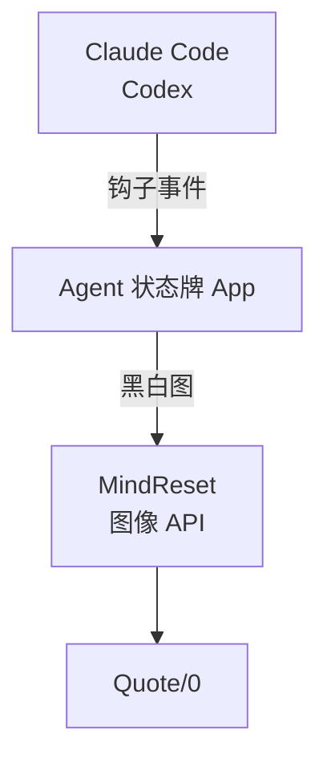

<div align="center">

# quote0-agent-board

**把 Claude Code 和 Codex 的运行状态显示在 Quote/0 墨水屏上**

谁在跑、谁在等你批准、谁做完了，抬头就能看到。

[](https://github.com/realruian/quote0-agent-board/actions/workflows/tests.yml)
[](LICENSE)


简体中文 · [English](README.en.md)


</div>

## 这是什么

[Quote/0](https://dot.mindreset.tech/docs/quote_0) 是 MindReset 出的一块 296×152 的黑白墨水屏。这个项目把它变成 AI 编程 Agent 的状态牌：Claude Code 和 Codex 每次开始、结束、需要你批准时，屏幕上的画面跟着变。

功能上参考了 Mac 上的 [Vibe Island](https://vibeisland.app)，区别是它只负责显示，批准和回答仍然在电脑上完成。

## 功能

- **三种画面自动切换**：有对话在跑时显示列表，需要你处理时整屏反色提醒，都空闲时显示剩余额度。
- **显示对话名称**：和 Claude、Codex 侧边栏里的名称一致，不是文件夹名，也不是你发的那句话。
- **剩余额度**：5 小时和每周额度的剩余百分比与重置时间。
- **为墨水屏设计的刷新**：状态变了才刷，短时间内的变化合并成一次，不会一直闪。
- **一个普通的 Mac App**：拖进「应用程序」就能用，不需要 Python。在它的窗口里调字体、提醒方式、免打扰时段，改动实时预览。
- **菜单栏和程序坞图标**：状态牌是否正常、有几个对话在等你，看图标就知道；点开菜单栏图标能看屏幕当前画面，暂停或退出。
- **不打扰 Agent**：钩子约 12 毫秒返回，出错也不会影响 Agent；和其他工具的钩子并排存在，不改动它们。
- **可以完整卸载**：改过的文件都有备份，在菜单里选「卸载…」恢复原样。

## 三种画面

<table>
<tr>
<td width="320"></td>
<td>

**总览**

一行一个对话，最多 4 行。左边的图标表示是哪个 Agent：方块实心是正在运行，空心是已结束。右边是时长：运行中是已经跑了多久，已完成是总共用了多久。顶栏是各家的剩余额度和重置时间。

</td>
</tr>
<tr>
<td></td>
<td>

**等你**

任何对话需要批准、回答提问或确认计划时，整屏反色接管。处理完自动回到总览。

</td>
</tr>
<tr>
<td></td>
<td>

**空闲**

没有对话在跑时，显示完整的额度条、重置时间和上一个完成的对话。

</td>
</tr>
</table>

图片由 `scripts/render_samples.py` 用演示数据渲染，和屏幕上的实际像素一致。

## 工作原理



- **钩子**（`bin/agent-board-hook`）：一个 shell 脚本，把事件的前 4 KB 转发给 App 后立即退出。
- **App**（`app/`，Swift）：维护每个对话的状态，决定什么时候刷屏，在本机把画面渲染成黑白图。设置窗口、菜单栏图标和它是同一个进程。
- **推送**：通过 MindReset 官方的[图像 API](https://dot.mindreset.tech/docs/service/open/image_api) 发到设备。

项目最早是用 Python 写的。Python 版还在仓库里，仍然能用，但不再加新功能，见下面的 [Python 版](#python-版)。

## 环境要求

- macOS 14 或更新版本，Apple 芯片和 Intel 都可以。
- 一台已联网、插着电的 Quote/0。
- Claude Code、Codex 至少装了一个。桌面应用和命令行都可以，它们用的是同一份钩子配置。
- 目前要自己从源代码构建 App，需要 Xcode 命令行工具（`xcode-select --install`）和系统自带的 `python3`。

## 安装

### 1. 准备设备

在 Dot. App 的内容工坊里，把「图像 API」添加到这台设备的循环列表。状态牌的画面就显示在这一项里。

循环列表里最好只留「图像 API」一项。有其他内容时，设备轮播到它们就会把状态牌换掉；App 会在一分钟内切回来，但屏幕会多闪两次。

### 2. 构建并打开 App

```bash
git clone https://github.com/realruian/quote0-agent-board.git
cd quote0-agent-board
python3 scripts/build_app.py
```

会生成 `dist/Agent 状态牌.app` 和 `dist/Agent-Board-<版本>.dmg`（约 9 MB；装了完整的 Xcode 时同时支持 Apple 芯片和 Intel，只有命令行工具时只支持本机的芯片）。把 App 拖进「应用程序」，从那里打开。

第一次打开时，App 做这几件事，改动的文件都会先备份到 `~/.quote0-agent-board/backups/`：

1. 把钩子脚本放到 `~/.quote0-agent-board/bin/`。
2. 在 `~/.claude/settings.json` 里追加 9 个钩子。
3. 在 `~/.codex/hooks.json` 里追加 7 个钩子。Codex 下次启动时会要求你确认信任。
4. 让自己开机自启（LaunchAgent `com.quote0.agent-board.menubar`）。
5. 如果装过 Python 版，接管它的后台进程。设置和钩子是通用的，不用重新配置。

钩子只对安装之后新开的对话生效。不想连接某个 Agent 的话，在窗口的「Agent」页里断开。

把 DMG 发给别人用时，这个 App **没有签名**：从网上下载的 DMG 第一次打开会被 macOS 拦一下，要到「系统设置 → 隐私与安全性」里点「仍要打开」。DMG 里的「先看这里.txt」写了步骤。

### 3. 在打开的窗口里连接设备

第一次打开会直接显示「连接设备」，照着做三步：

1. **填 API 密钥**：在 Dot. App 的「更多」标签页进入「API 密钥」，创建一个密钥并复制（[官方说明](https://dot.mindreset.tech/docs/service/open/get_api)），粘贴进去。
2. **选设备**：窗口会列出这个密钥下的设备，点「使用这台」。
3. **看一眼屏幕**：窗口会检查「图像 API」有没有加好，可以发一张测试画面确认。

以后要换密钥或换设备，也在这个页面里改。

连接设备时，会把设备插电时的轮播间隔调到 12 小时，减少状态牌被换掉的机会。不想要的话，在「刷新」页里关掉「始终显示状态牌」。

## 菜单栏和程序坞图标

菜单栏图标的形状始终是状态牌的标志，有情况时在右下角加一个小角标：

| 图标 | 意思 |
|---|---|
| 没有角标 | 一切正常 |
| 旁边有数字 | 有这么多个对话在等你处理；程序坞图标上也有同样的数字 |
| 省略号 | 还没有连接设备 |
| 暂停 | 已暂停 |
| 月亮 | 设备休眠或离线，最新画面还没显示到屏幕上 |
| 感叹号 | 最近一次刷新失败 |

点开菜单栏图标能看到屏幕当前画面，以及画面上放不下的对话，还有这几个操作：

- **打开设置…**：打开 App 的窗口。点程序坞图标、再次打开这个 App 也是同样的效果。
- **刷新屏幕**：马上重新发送一次当前画面。
- **暂停 / 恢复**：暂停后屏幕显示“已暂停”，不再更新，直到你恢复。
- **退出**：屏幕显示“已退出”，状态牌停止工作。重新打开 App，或者下次登录时，会自动恢复。

刷新和暂停在程序坞图标的右键菜单里也有。两个图标都可以不留：

- **菜单栏图标**：在窗口的「关于」页或屏幕顶部的「Agent 状态牌」菜单里取消「在菜单栏显示图标」。
- **程序坞图标**：在同样的两个地方取消「关闭窗口后保留程序坞图标」。之后窗口一关，程序坞里的图标就消失；再打开窗口时图标回来。

两个图标互不影响。都不留时状态牌照常在后台工作，在启动台、Spotlight 或访达里再打开一次 App，窗口就回来。

## 设置

设置都在 App 的窗口里：点程序坞图标，或者菜单栏图标里的「打开设置…」。


| 页面 | 能做什么 |
|---|---|
| 总览 | 屏幕当前画面、屏幕和设备是否正常、剩余额度、当前对话；手动刷新屏幕、发送测试画面 |
| 画面 | 屏幕上显示什么：字体、对话名称和额度、最多行数、对话保留多久、项目别名和隐藏 |
| 刷新 | 屏幕什么时候更新：插电时的最小间隔、用电池时的刷新间隔、是否始终显示状态牌、夜间免打扰、设备定时休眠 |
| 提醒 | 哪些情况整屏提醒 |
| Agent | 单独连接或断开 Claude Code 和 Codex |
| 设备 | 状态、供电、信号、固件；设备名称 |
| 诊断 | 一键自检、查看日志 |
| 关于 | 版本和文件位置；是否保留菜单栏图标和程序坞图标；卸载 |

设置改完自动保存、立即生效，存在 `~/.quote0-agent-board/config.json`。

字体只列出本机有的：苹方（默认）、MiSans、冬青黑体，以及随 App 附带的三个像素字体。屏幕没有灰度，文字不做抗锯齿，所以不同字体的笔画粗细会有差别。像素字体里，方舟像素是按 12 像素画的；正格点黑和寒蝉点阵体是按 16 像素画的，选它们时对话名称一个点对一个像素，笔画是 1 像素宽，最锐利也最细；小字和整屏提醒的大字仍用方舟像素。所选字体缺某个字时，这个字自动用冬青黑体补上，不会显示成方框；方舟像素目前缺约二十分之一的常用字（例如“然”“热”“鉴”）。

## 剩余额度

额度数据来自 Codex 和 Claude Code 自己。本项目不登录任何账号，也不读取登录凭证。

| | 来源 | 可信范围 |
|---|---|---|
| Codex | Codex 写在 `~/.codex/sessions/` 里的对话记录 | 一直有效，过了重置时间视为已恢复 |
| Claude | 每 5 分钟问一次本机的 `claude` 命令行，它用自己已有的登录向 Anthropic 查询 | 只信 20 分钟内的读数，过期显示"—"或"暂无数据" |

两点限制：

- **Claude 额度需要在终端里登录过 Claude Code。** 只用桌面 App 的话，在终端里运行一次 `claude auth login`。没登录时屏幕上的 Claude 额度是空的，其他功能不受影响。
- **读 Claude 额度用的是 Claude Code 没有公开说明的接口。** Claude Code 升级后可能读不到，那时这一项会空着，其他功能不受影响。
- **只显示套餐实际报告的窗口。** 比如 Codex 的套餐只报告每周额度时，就没有 5 小时那一项。

重置时间写的是固定时刻（当天的钟点，或者星期几），不是倒计时，这样两次刷新之间也不会过时。

## 刷新策略

墨水屏每刷一次都会整屏闪一下，大约 2 秒，所以刷新要省着用：

- 画面内容变了才刷。
- 2 秒内的多次变化合并成一次。
- 普通变化之间至少隔 10 秒，可在「刷新」页调大。出现"等你"时不受这个限制，立即刷。
- 运行时长不是每分钟更新：不到 5 分钟显示 `<5m`，之后所有行统一每 5 分钟更新一次。
- 额度每变化 5 个百分点才会单独刷一次。

## 隐私与安全

- **本项目发出去的只有渲染好的画面。** 读 Claude 额度时由 `claude` 命令行自己联系 Anthropic，本项目不经手它的登录信息。画面是一张 296×152 的黑白图，经 MindReset 的服务器发到设备。图上有对话名称、Agent 图标、状态、时长和额度百分比。不想让对话名称经过服务器的话，在「画面」页关掉"显示对话名称"，屏幕上就只显示项目文件夹的名字。
- **钩子只把数据交给本机的 App。** 转发的是事件的前 4 KB，里面有对话编号、工作目录、工具名和你那句话的开头，没有文件内容和工具输出。
- **API 密钥只存在 `~/.dot_api_key` 里**，只有你自己能读。在窗口里填的密钥由 App 写进这个文件，之后不会再出现在窗口、配置文件或日志里。
- **App 不监听任何网络端口。** 钩子通过 `~/.quote0-agent-board/run/` 里的本机套接字把事件交给它，这个套接字只有你自己能访问。

发现安全问题请看 [SECURITY.md](SECURITY.md)。

## 更新与卸载

更新到最新版本：先在菜单栏里退出 App，再重新构建，用新的 App 替换「应用程序」里的旧的，然后打开。

```bash
git pull
python3 scripts/build_app.py
```

卸载：在屏幕顶部的「Agent 状态牌」菜单里选「卸载…」，或者在窗口的「关于」页里点卸载，然后把 App 拖进废纸篓。卸载会移除钩子、取消开机自启，并把设备的轮播间隔恢复原值。设置和日志会留在 `~/.quote0-agent-board/`，不想要的话手动删掉这个文件夹。

## 文件位置

| 位置 | 内容 |
|---|---|
| `/Applications/Agent 状态牌.app` | App |
| `~/.quote0-agent-board/config.json` | 设置 |
| `~/.quote0-agent-board/logs/daemon.log` | 日志 |
| `~/.quote0-agent-board/last-frame.png` | 最近一次推送的画面 |
| `~/.quote0-agent-board/backups/` | App 改动过的文件的备份 |
| `~/.quote0-agent-board/bin/agent-board-hook` | 钩子脚本 |
| `~/Library/LaunchAgents/com.quote0.agent-board.menubar.plist` | 开机自启的注册文件 |

## 已知限制

- **批准后仍显示"等你批准"**：Agent 的钩子里没有"用户已批准"这个事件，要等那条命令执行完才会切回运行中。命令跑得久时会误报。
- **按 Esc 中断后要等一会儿才显示已结束**：中断不会触发结束事件，App 每半分钟看一次 Agent 自己的对话记录，从里面认出中断，所以最多晚半分钟。被中断的对话和正常完成的一样显示成已结束。
- **出错和完成没有整屏提醒**：只有等批准、等回答、等看计划三种情况会整屏接管。
- **必须插电**：用电池时设备会休眠，只在定时唤醒的那一刻更新，屏幕会停在休眠前的画面。这时窗口的总览和设备页会标出“设备休眠”，间隔可以在「刷新」页改（最短 1 分钟）；设备醒来后自动补上最新画面。
- **依赖 MindReset 的云服务**：电脑断网或服务不可用时，屏幕停在最后一个画面。
- **界面和屏幕上的文字只有中文。**
- **只在作者自己的设备上长期用过**：Quote/0 固件 2.0.8，Claude 和 Codex 的桌面应用。

## Python 版

项目最早的实现：一个由 launchd 管理的 Python 后台进程，设置在浏览器里的本地页面（<http://127.0.0.1:8765>）里改，菜单栏图标是安装时在本机编译的一个小 App。它仍然能用，测试也还在跑，但**不再加新功能**，只修会影响使用的问题。和 App 相比，它目前少这几样：

- 按 Esc 中断的对话不会被认出来，要等你发下一条消息，或 60 分钟后自动移除。
- Codex 开着自动审查时，权限请求仍然会显示成“等你批准”。
- 没有正格点黑和寒蝉点阵体这两个字体。
- 没有程序坞图标和原生窗口。

它有而 App 没有的是命令行：`python3 -m agent_board.cli status` 列出当前的对话，`open` 打开设置页，`preview out.png` 把当前画面存成图片。

需要 Python 3.9 或更新版本和 Pillow 9.0 或更新版本；菜单栏图标还需要 Xcode 命令行工具，没装时安装脚本会跳过它。

```bash
python3 -m pip install -r requirements.txt
python3 install.py
```

安装脚本跑完会在浏览器里打开「连接设备」。不想用浏览器的话，把密钥存进 `~/.dot_api_key`（权限 600），再运行 `python3 install.py --device <设备序列号>`。后台进程会用你运行安装脚本时的那个 `python3`，Pillow 要装在它里面；用 Homebrew 的 Python 时，`pip` 可能拒绝安装，改用 `brew install pillow` 即可。`--no-codex` 和 `--no-menubar` 分别跳过 Codex 的钩子和菜单栏图标。

- **更新**：`git pull` 之后再运行一次 `python3 install.py`。
- **卸载**：`python3 install.py --uninstall`，加 `--purge` 同时删除 `~/.quote0-agent-board/`。
- **和 App 来回切换**：两者共用配置文件和钩子，但同时只能运行一个。打开 App 时它会自动接管 Python 版的后台进程；要切回 Python 版，先在菜单栏里退出 App，再运行 `python3 install.py`。
- **设置页的安全**：它只监听本机地址，其他设备访问不到。请求要带页面自己的一次性口令，修改类请求还会校验来源，所以你浏览的其他网站调用不了它。
- **文件**：后台进程注册在 `~/Library/LaunchAgents/com.quote0.agent-board.plist`，菜单栏 App 在 `~/Applications/Agent 状态牌.app`。

## 开发

App 的代码在 `app/`。运行测试：

```bash
swift test --package-path app
```

调试时可以另开一个不碰真实设备的实例。它用单独的目录，只渲染不推送，也不会改动钩子和开机自启：

```bash
AGENT_BOARD_HOME="$PWD/.dev-home" AGENT_BOARD_DRY_RUN=1 AGENT_BOARD_RESOURCES="$PWD/agent_board" swift run --package-path app
```

Python 版的测试是 `python3 -m unittest discover -s tests`。

更多说明见 [CONTRIBUTING.md](CONTRIBUTING.md)，版本变化见 [CHANGELOG.md](CHANGELOG.md)。

## 致谢与声明

- 功能设计参考了 [Vibe Island](https://vibeisland.app)。
- 随项目附带的像素字体是 [方舟像素字体](https://github.com/TakWolf/ark-pixel-font)、[正格点黑 16](https://github.com/yzdnn/ZhengGeDianHei-16) 和 [寒蝉点阵体 16px](https://github.com/Warren2060/ChillBitmap)，都按 SIL OFL 1.1 许可分发，许可全文在 `agent_board/fonts/` 里各自的文件中。
- App 窗口里的图标来自 [Hugeicons](https://hugeicons.com) 的免费图标集，按 MIT 许可分发，许可全文在 `app/Hugeicons-LICENSE.md`。
- 这是个人项目，和 MindReset、Anthropic、OpenAI、Vibe Island 都没有关联。屏幕上的 Agent 图标只用来标识对应的产品，App 图标里的锯齿圆形取自 Dot. App 的图标，表示它运行在 Dot. 的设备上；相关名称和标志归各自的所有者。

## 许可证

[MIT](LICENSE)。随项目附带的三个像素字体不在此列，它们按 SIL OFL 1.1 分发。
