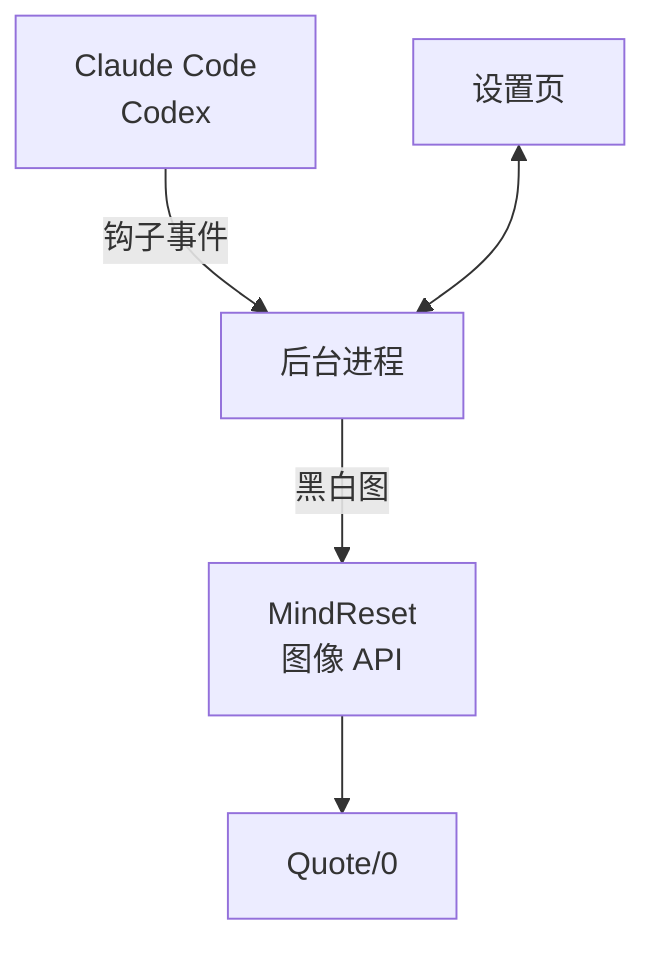

<div align="center">

# quote0-agent-board

**把 Claude Code 和 Codex 的运行状态显示在 Quote/0 墨水屏上**

谁在跑、谁在等你批准、谁做完了，抬头就能看到。

[](https://github.com/realruian/quote0-agent-board/actions/workflows/tests.yml)
[](LICENSE)


简体中文 · [English](README.en.md)


</div>

## 这是什么

[Quote/0](https://dot.mindreset.tech/docs/quote_0) 是 MindReset 出的一块 296×152 的黑白墨水屏。这个项目把它变成 AI 编程 Agent 的状态牌：Claude Code 和 Codex 每次开始、结束、需要你批准时，屏幕上的画面跟着变。

功能上参考了 Mac 上的 [Vibe Island](https://vibeisland.app)，区别是它只负责显示，批准和回答仍然在电脑上完成。

## 功能

- **三种画面自动切换**：有对话在跑时显示列表，需要你处理时整屏反色提醒，都空闲时显示剩余额度。
- **显示对话名称**：和 Claude、Codex 侧边栏里的名称一致，不是文件夹名，也不是你发的那句话。
- **剩余额度**：5 小时和每周额度的剩余百分比与重置时间。
- **为墨水屏设计的刷新**：状态变了才刷，短时间内的变化合并成一次，不会一直闪。
- **本地设置页**：在浏览器里调字体、提醒方式、免打扰时段，改动实时预览。
- **不打扰 Agent**：钩子约 12 毫秒返回，出错也不会影响 Agent；和其他工具的钩子并排存在，不改动它们。
- **可以完整卸载**：改过的文件都有备份，一条命令恢复原样。

## 三种画面

<table>
<tr>
<td width="320"></td>
<td>

**总览**

一行一个对话，最多 4 行。左边的图标表示是哪个 Agent：方块实心是正在运行，空心是已结束。右边是时长：运行中是已经跑了多久，已完成是总共用了多久。顶栏是各家的剩余额度和重置时间。

</td>
</tr>
<tr>
<td></td>
<td>

**等你**

任何对话需要批准、回答提问或确认计划时，整屏反色接管。处理完自动回到总览。

</td>
</tr>
<tr>
<td></td>
<td>

**空闲**

没有对话在跑时，显示完整的额度条、重置时间和上一个完成的对话。

</td>
</tr>
</table>

图片由 `scripts/render_samples.py` 用演示数据渲染，和屏幕上的实际像素一致。

## 工作原理



- **钩子**（`bin/agent-board-hook`）：一个 shell 脚本，把事件的前 4 KB 转发给后台进程后立即退出。
- **后台进程**（`agent_board/daemon.py`）：维护每个对话的状态，决定什么时候刷屏，用 Pillow 在本机把画面渲染成黑白图。
- **推送**：通过 MindReset 官方的[图像 API](https://dot.mindreset.tech/docs/service/open/image_api) 发到设备。

## 环境要求

- macOS。后台进程由 launchd 管理，字体用的是系统自带的中文字体。
- Python 3.9 或更新版本，以及 Pillow 9.0 或更新版本。
- 一台已联网、插着电的 Quote/0。
- Claude Code、Codex 至少装了一个。桌面应用和命令行都可以，它们用的是同一份钩子配置。

## 安装

### 1. 准备设备

在 Dot. App 的内容工坊里，把「图像 API」添加到这台设备的循环列表。状态牌的画面就显示在这一项里。

循环列表里最好只留「图像 API」一项。有其他内容时，设备轮播到它们就会把状态牌换掉；后台进程会在一分钟内切回来，但屏幕会多闪两次。

### 2. 保存 API 密钥

在 Dot. App 的「更多」标签页进入「API 密钥」，创建一个密钥并复制（[官方说明](https://dot.mindreset.tech/docs/service/open/get_api)）。然后在终端里运行：

```bash
pbpaste > ~/.dot_api_key && chmod 600 ~/.dot_api_key
```

密钥只存在这个文件里，不会写进配置、日志或设置页。

### 3. 找到设备序列号

在 Dot. App 的「更多」标签页，点头像下方的设备列表，选中设备后复制设备 ID（[官方说明](https://dot.mindreset.tech/docs/service/open/get_device_id)）。

### 4. 运行安装脚本

```bash
git clone https://github.com/realruian/quote0-agent-board.git
cd quote0-agent-board
python3 -m pip install -r requirements.txt
python3 install.py --device <设备序列号>
```

后台进程会用你运行安装脚本时的那个 `python3`，Pillow 要装在它里面。用 Homebrew 的 Python 时，`pip` 可能拒绝安装，改用 `brew install pillow` 即可。

安装脚本做这几件事，改动的文件都会先备份到 `~/.quote0-agent-board/backups/`：

1. 把运行文件复制到 `~/.quote0-agent-board/`。
2. 注册开机自启的后台进程（LaunchAgent `com.quote0.agent-board`）。
3. 在 `~/.claude/settings.json` 里追加 9 个钩子。
4. 在 `~/.codex/hooks.json` 里追加 7 个钩子。Codex 下次启动时会要求你确认信任。加 `--no-codex` 可跳过。
5. 把设备插电时的轮播间隔调到 12 小时，减少状态牌被换掉的机会。加 `--no-hold` 可跳过。

钩子只对安装之后新开的对话生效。

## 设置页

装好后在浏览器里打开 <http://127.0.0.1:8765>。


| 页面 | 能做什么 |
|---|---|
| 总览 | 屏幕当前画面、后台进程和设备状态、当前对话；手动刷新屏幕、发测试画面 |
| 显示 | 字体、是否显示对话名称和额度、最多几行、完成后保留多久、项目别名和隐藏 |
| 提醒 | 哪些情况整屏提醒、最小刷新间隔、夜间免打扰 |
| 集成 | 单独开关 Claude Code 和 Codex 的钩子 |
| 设备 | 信号、供电、固件；设备名称、是否让状态牌常显、设备睡眠时段 |
| 诊断 | 一键自检、查看日志、重启后台进程 |
| 关于 | 版本和文件位置 |

设置改完自动保存、立即生效，存在 `~/.quote0-agent-board/config.json`。端口在这个文件的 `web_port` 里改，改完需要重启后台进程。

字体只列出本机有的：苹方（默认）、MiSans、冬青黑体，以及随项目附带的方舟像素字体。屏幕没有灰度，文字不做抗锯齿，所以不同字体的笔画粗细会有差别。

## 剩余额度

额度数据都读自本机已有的文件，不登录任何账号，也不读取登录凭证。

| | 来源 | 可信范围 |
|---|---|---|
| Codex | Codex 写在 `~/.codex/sessions/` 里的对话记录 | 一直有效，过了重置时间视为已恢复 |
| Claude | Vibe Island 留在本机的额度记录 | 只信 20 分钟内的读数，过期显示"—"或"暂无数据" |

两点限制：

- **Claude 额度需要装了 Vibe Island，并且它自己能拿到数据。** 没装 Vibe Island 时，屏幕上的 Claude 额度是空的，其他功能不受影响。
- **只显示套餐实际报告的窗口。** 比如 Codex 的套餐只报告每周额度时，就没有 5 小时那一项。

重置时间写的是固定时刻（当天的钟点，或者星期几），不是倒计时，这样两次刷新之间也不会过时。

## 刷新策略

墨水屏每刷一次都会整屏闪一下，大约 2 秒，所以刷新要省着用：

- 画面内容变了才刷。
- 2 秒内的多次变化合并成一次。
- 普通变化之间至少隔 10 秒，可在设置页调大。出现"等你"时不受这个限制，立即刷。
- 运行时长不是每分钟更新：不到 5 分钟显示 `<5m`，之后所有行统一每 5 分钟更新一次。
- 额度每变化 5 个百分点才会单独刷一次。

## 隐私与安全

- **会离开本机的只有渲染好的画面。** 画面是一张 296×152 的黑白图，经 MindReset 的服务器发到设备。图上有对话名称、Agent 图标、状态、时长和额度百分比。不想让对话名称经过服务器的话，在设置页关掉"显示对话名称"，屏幕上就只显示项目文件夹的名字。
- **钩子只把数据交给本机的后台进程。** 转发的是事件的前 4 KB，里面有对话编号、工作目录、工具名和你那句话的开头，没有文件内容和工具输出。
- **API 密钥只从 `~/.dot_api_key` 读取**，不会出现在配置文件、日志和设置页里。
- **设置页只监听本机地址**，其他设备访问不到。请求要带页面自己的一次性口令，修改类请求还会校验来源，所以你浏览的其他网站调用不了它。

发现安全问题请看 [SECURITY.md](SECURITY.md)。

## 更新与卸载

更新到最新版本：

```bash
git pull
python3 install.py
```

卸载：

```bash
python3 install.py --uninstall
```

卸载会移除钩子和后台进程，并把设备的轮播间隔恢复原值。加 `--purge` 同时删除 `~/.quote0-agent-board/`。

## 命令行和文件位置

在项目目录里运行：

```bash
python3 -m agent_board.cli status
```

`status` 列出当前的对话，`open` 在浏览器里打开设置页，`preview out.png` 把当前画面存成图片。

| 位置 | 内容 |
|---|---|
| `~/.quote0-agent-board/config.json` | 设置 |
| `~/.quote0-agent-board/logs/daemon.log` | 日志 |
| `~/.quote0-agent-board/last-frame.png` | 最近一次推送的画面 |
| `~/.quote0-agent-board/backups/` | 安装和设置页改动过的文件的备份 |
| `~/Library/LaunchAgents/com.quote0.agent-board.plist` | 后台进程的注册文件 |

## 已知限制

- **批准后仍显示"等你批准"**：Agent 的钩子里没有"用户已批准"这个事件，要等那条命令执行完才会切回运行中。命令跑得久时会误报。
- **按 Esc 中断后仍显示运行中**：中断不会触发结束事件，要等你发下一条消息，或 60 分钟后自动移除。
- **出错和完成没有整屏提醒**：只有等批准、等回答、等看计划三种情况会整屏接管。
- **必须插电**：用电池时设备会休眠，状态会延迟。
- **依赖 MindReset 的云服务**：电脑断网或服务不可用时，屏幕停在最后一个画面。
- **界面和屏幕上的文字只有中文。**
- **只在作者自己的设备上长期用过**：Quote/0 固件 2.0.8，Claude 和 Codex 的桌面应用。

## 开发

```bash
python3 -m unittest discover -s tests
```

调试时可以另开一个不碰真实设备的实例：

```bash
AGENT_BOARD_HOME="$PWD/.dev-home" AGENT_BOARD_DRY_RUN=1 AGENT_BOARD_PORT=8766 python3 -m agent_board.daemon
```

更多说明见 [CONTRIBUTING.md](CONTRIBUTING.md)，版本变化见 [CHANGELOG.md](CHANGELOG.md)。

## 致谢与声明

- 功能设计参考了 [Vibe Island](https://vibeisland.app)。
- 随项目附带的像素字体是 [方舟像素字体](https://github.com/TakWolf/ark-pixel-font)，按 SIL OFL 1.1 许可分发，许可全文在 `agent_board/fonts/ark-pixel-OFL.txt`。
- 这是个人项目，和 MindReset、Anthropic、OpenAI、Vibe Island 都没有关联。屏幕上的 Agent 图标只用来标识对应的产品，相关名称和标志归各自的所有者。

## 许可证

[MIT](LICENSE)
